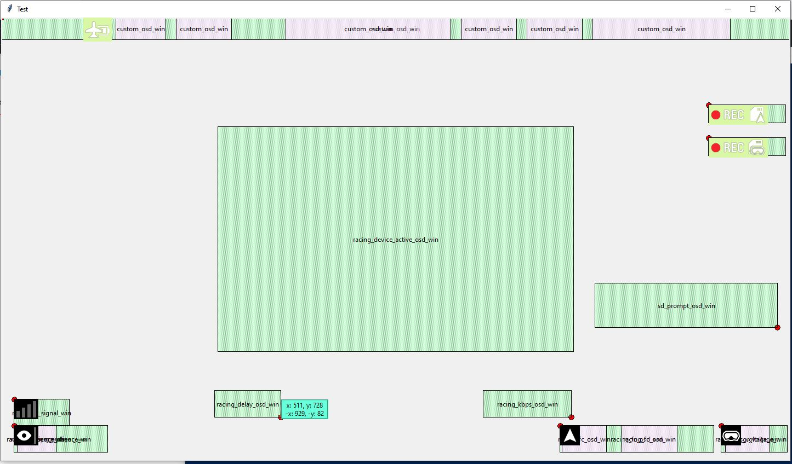
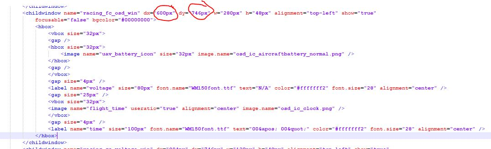
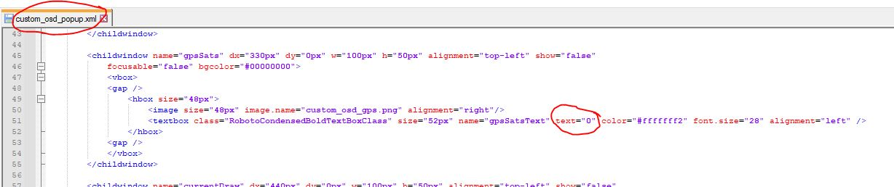

# dji_stuff
python script for reading the racing_chnl_osd_win.xml for faster edit mode. Edit position in file and call script again to show where the new position lable is.

Files from goggle: \system\gui\xml\racing_chnl_osd_win.xml

call Script: python.exe .\show_xml.py -i .\racing_chnl_osd_win.xml

Upload file: adb.exe push .\racing_chnl_osd_win.xml /system/gui/xml

Change pixel values, Run script again and see where new position is.

FIX 14 Sats @ custom DJI OSD

